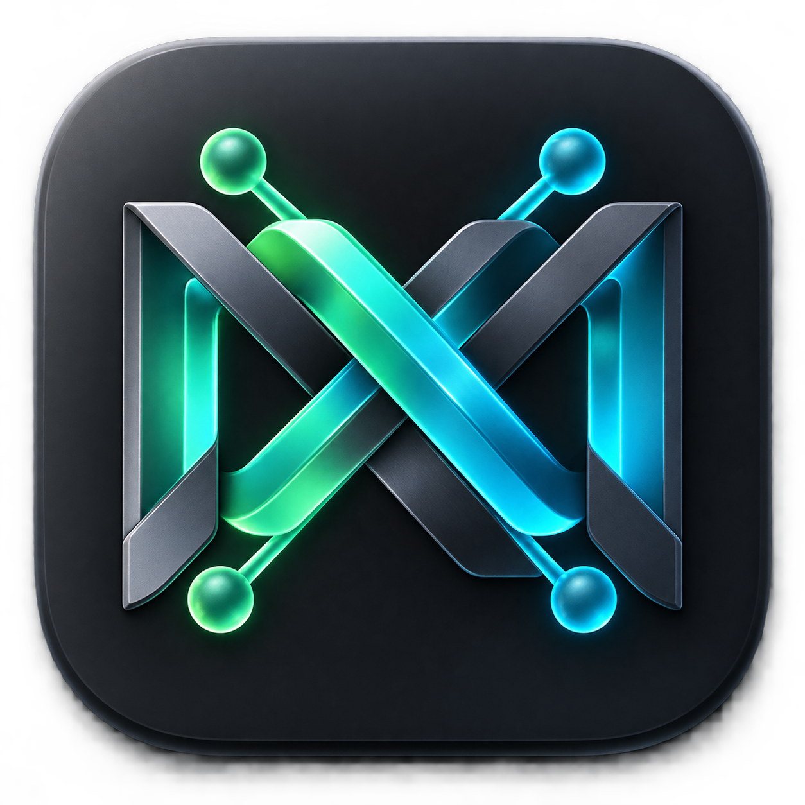
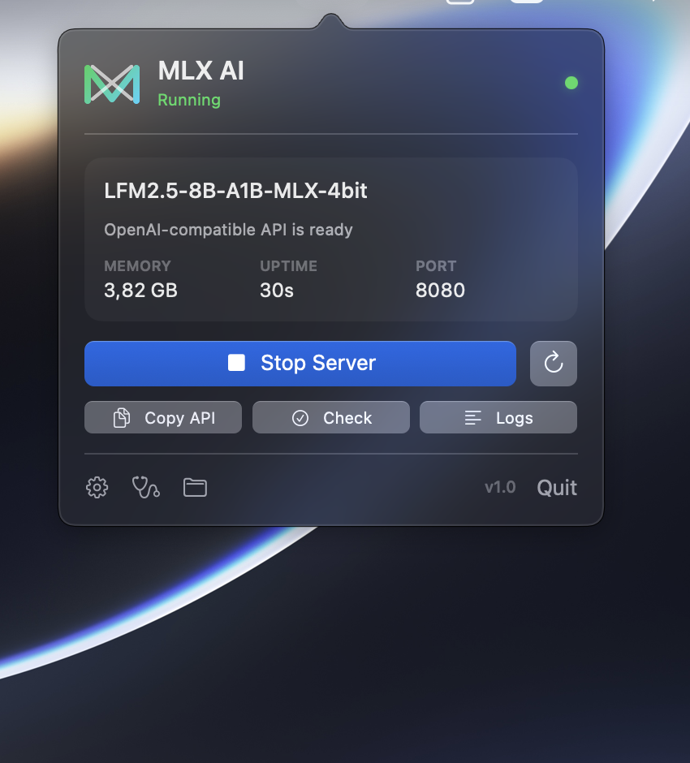
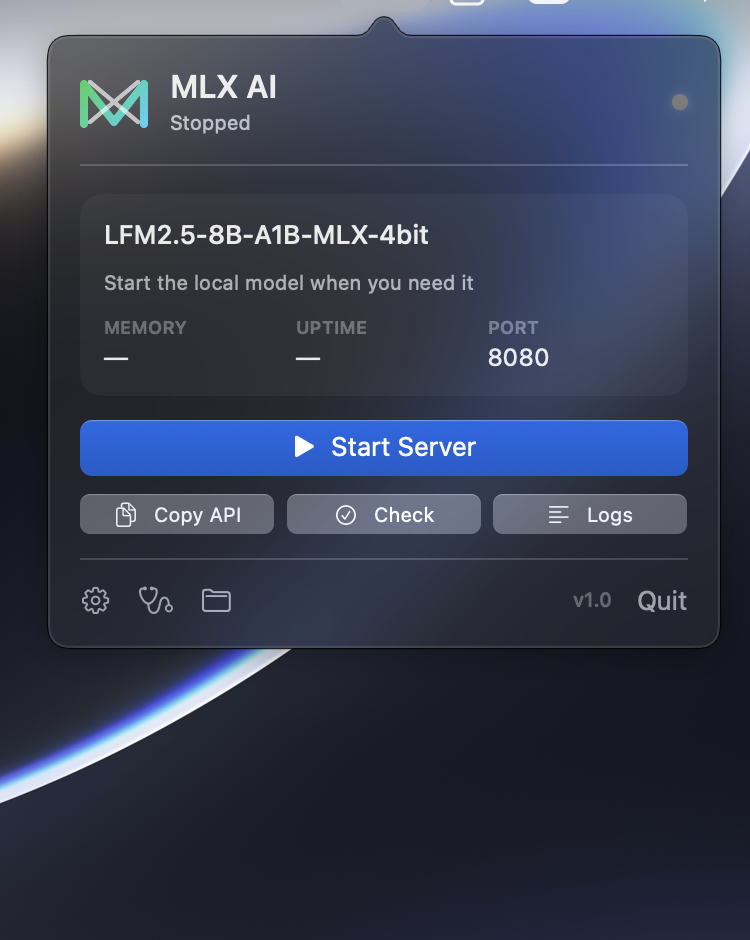

# MLX AI

<p align="center"></p>
<p align="center"><strong>A polished macOS menu-bar controller for local MLX language models.</strong></p>

<p align="center">
  <a href="https://github.com/k6w/mlx-ai-app/actions/workflows/ci.yml"></a>
  <a href="LICENSE"></a>
  
</p>

MLX AI starts, monitors, and stops an OpenAI-compatible [`mlx_lm.server`](https://github.com/ml-explore/mlx-lm) without keeping a terminal open. The server is bound to localhost and managed by launchd, so the menu app and companion CLI always agree.

> MLX AI is an independent open-source project and is not affiliated with or endorsed by Apple or the MLX project.

## Features

- Native SwiftUI/AppKit menu-bar experience with live status, memory, uptime, and diagnostics.
- Start, stop, and restart a launchd-managed server that survives UI restarts.
- First-run installation of isolated Python 3.11 and pinned `mlx-lm`—no administrator access or system Python changes.
- OpenAI-compatible API at `http://127.0.0.1:8080/v1`.
- Optional companion CLI with human-readable and JSON status.
- Failure notifications, login controls, safe log rotation, and external-process protection.
- Reproducible ad-hoc-signed DMG releases with no Developer ID identity attached.

## Screenshots

<table>
  <tr>
    <td align="center"><strong>Running on macOS</strong></td>
    <td align="center"><strong>Stopped on macOS</strong></td>
  </tr>
  <tr>
    <td></td>
    <td></td>
  </tr>
</table>

## Requirements

- Apple Silicon Mac running macOS 13 Ventura or newer
- Internet access during first setup and first model launch
- Roughly 5 GB of disk space and memory for the default model

## Install

1. Download the latest `MLX-AI-*.dmg` from [Releases](https://github.com/k6w/mlx-ai-app/releases/latest).
2. Drag **MLX AI** to Applications.
3. Right-click the app and choose **Open** the first time. If macOS blocks it, use **System Settings → Privacy & Security → Open Anyway**.
4. Choose **Install Runtime**.
5. Click **Start Server**. The default model downloads on first use.

The runtime lives under `~/Library/Application Support/MLX AI`. Existing installations using `~/.mlx-venv` are adopted automatically.

Install the optional terminal command from MLX AI Settings:

```sh
mlx-ai                  # start and wait until ready
mlx-ai status           # health, model, memory, and uptime
mlx-ai status --json    # stable machine-readable output
mlx-ai stop             # stop and release model memory
mlx-ai restart
mlx-ai logs --follow
mlx-ai doctor
```

## Build from source

Install Xcode or matching Xcode Command Line Tools, then:

```sh
make test
make app
make dmg
```

For a clean-Mac bootstrap, place arm64 `uv` on `PATH` or set `UV_BINARY=/path/to/uv`. Without it, the app can adopt an existing environment but cannot install a new one.

Local and release builds are intentionally ad-hoc signed and contain no Developer ID or Apple account identity. See [RELEASING.md](RELEASING.md).

## Architecture

- `MLXAI`: accessory app using `NSStatusItem`, `NSPopover`, and SwiftUI.
- `MLXAIKit`: runtime bootstrap, health checks, launchd lifecycle, metrics, and state machine.
- `mlx-ai`: standalone CLI built from the same controller library.

Runtime data:

- Configuration: `~/Library/Application Support/MLX AI/config.json`
- Managed runtime: `~/Library/Application Support/MLX AI/runtime`
- Server log: `~/Library/Logs/MLX AI/server.log`
- Launch agent: `~/Library/LaunchAgents/com.drwn.mlxai.server.plist`

The API host is fixed to `127.0.0.1`; `mlx_lm.server` is not a production-secured network service.

Contributions are welcome—read [CONTRIBUTING.md](CONTRIBUTING.md). Report vulnerabilities privately as described in [SECURITY.md](SECURITY.md).

Licensed under the [MIT License](LICENSE).
